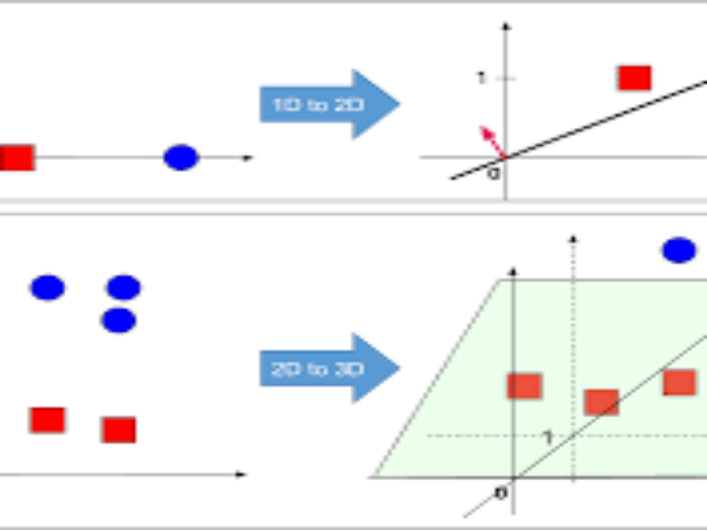

# Perceptron-Algorithm-from-snatch

## Overview

In this project, we implement the Perceptron algorithm from scratch to perform binary classification tasks. The Perceptron algorithm is a fundamental supervised learning algorithm that learns to classify data points into two classes based on a set of features.

## Dataset

We utilized a labeled dataset for training and testing the Perceptron algorithm. The dataset is included in the `data/` directory of this repository. You can substitute it with your own dataset by following the structure provided.

## Implementation

Our implementation of the Perceptron algorithm can be found in the Jupyter Notebook `perceptron_algorithm.ipynb`. Key components of our implementation include:
- **Initialization:** Initializing weights and bias.
- **Training:** Iteratively updating weights based on misclassified samples.
- **Prediction:** Making predictions using learned weights.
- **Evaluation:** Assessing the performance of the Perceptron model on the test dataset.

## Repository Structure

- **data/:** Directory containing the dataset used for training and testing.
- **perceptron_algorithm.ipynb:** Jupyter Notebook containing the code for implementing the Perceptron algorithm.

## Running the Notebook

To run the notebook:
1. Ensure Python and Jupyter Notebook are installed.
2. Clone this repository:
   ```bash
   git clone https://github.com/your-username/Perceptron-Algorithm-Project.git
   cd Perceptron-Algorithm-Project
